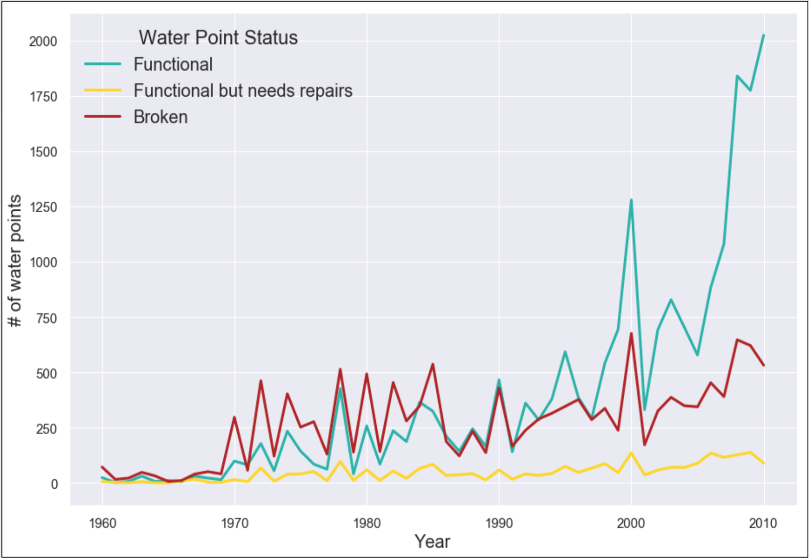
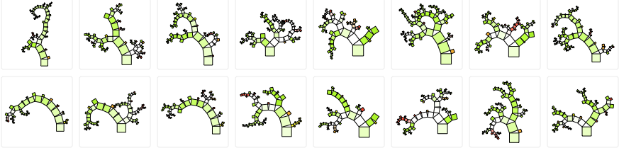
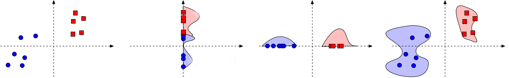
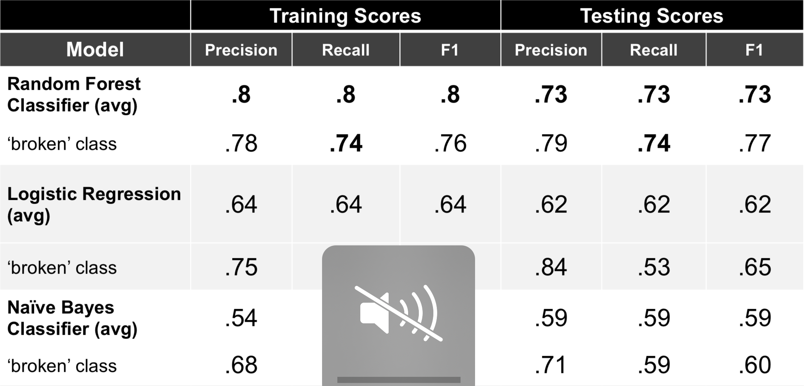
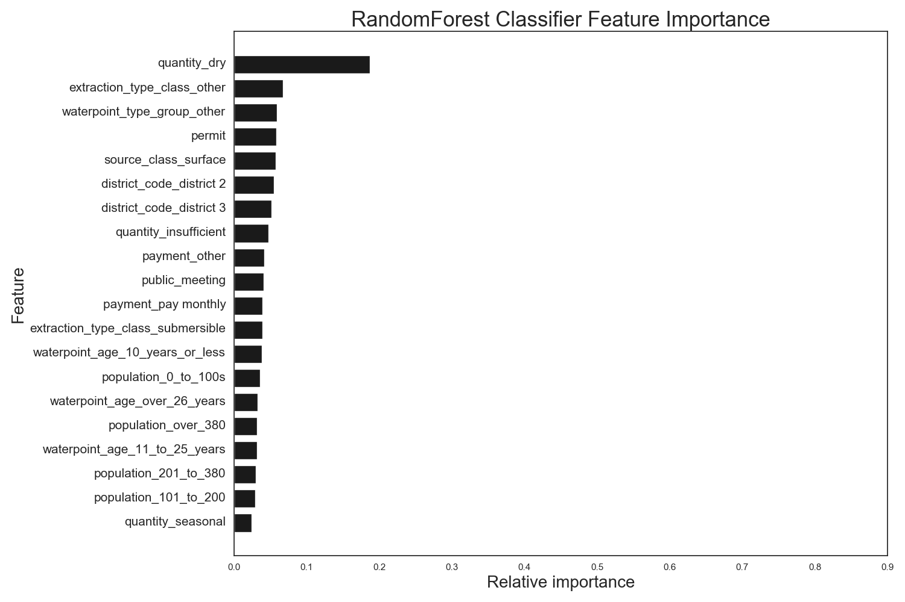
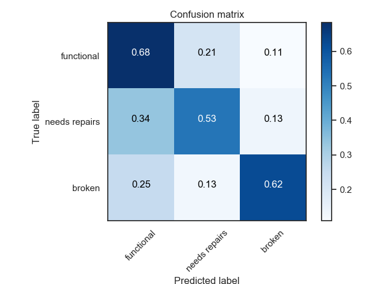

# Is There Water?
### Tanzania

A social impact driven tech firm hosts open competitions to crowdsource data science solutions to social challenges, with potential utility by organizations and institutions taking on those challenges. The online challenges last a few months, the global community of data scientists can compete to provide the best statistical model for difficult predictive social impact problems. One of the competitions asks participants to predict whether or not any given water point - from a dataset with a variety of descriptive feature data on tens of thousands of water points - is functioning, in need of repair, or broken.

Tanzania has achieved has averaged 6.5% economic growth over the past decade and is on its way to becoming a middle income country. But inequalities are entrenched, and the country has seen only a modest reduction in poverty over the same period. Some 40% of the country's population are unable to rely on regular access to safe drinking water sources.

In rural and underprivileged areas, improved water points are funded and installed by a wide array of actors - including the local government, civil society, international donors, private companies, and individuals - using a variety of technologies and water sourcing methods. Understanding when or how a water point might break or need maintenance could inform budget allocations and maintenance scheduling, ultimately optimizing access to safe water with those resources.

## The analysis questions
* What are the key predictors of whether or not a water point is functioning on any given day?
* Is there a machine learning model that can identify with reasonable certainty which water points are likely to need maintenance or replacement?

[**Interactive map**](https://sites.google.com/view/is-there-water/home)

## The dataset
* The raw CSV dataset, provided by the online competition, has 59,400 rows (each representing a water point in Tanzania) and 40 columns of descriptive features, which include information on various levels of geographical location, population using the water point, water point management and payment schemes, type and age of the hardware, water pressure at the tap, and type of water source.
* The target (to be predicted) is a categorical column with three classes: 'functional,' 'functional needs repair,' and 'non functional.'
* The following represents the first 5,000 rows of the dataset, with the white lines indicating missing data:

## **Exploratory data analysis (EDA), feature engineering, and feature selection**

* Some features were eliminated due to missing values or redundance in the dataset. Others were transformed for clarity in analysis. All continuous numerical features were ultimately converted into categorical ranges.
* Details on feature engineering:
  * 'population' was converted to categorical data. 48% are of the original dataset had 0s and 1s (probably inaccurate) for population, and so the value of 'unknown' was assigned to those. The rest of the data was divided into 1st, 2nd, or 3rd population quartile categories.
  * 'amount_tsh' is a measure of water pressure available at the tap. 70% in the dataset are zeros for this feature. That could be error, or it could mean water has to be pumped manually. 470 entries are between 5,000 - 350,000, and without more contextual information, those values are somewhat uninterrpretable. The feature was converted into categorical ranges.
  * The 'permit' feature has 3,056 missing values in the dataset, which were converted to 'False', meaning the water point is not permited.
  * The 'public_meeting' feature has over 3,000 missing values, which were converted to 'False', meaning no public meeting. It is not clear from the dataset what public meeting refers to, but it could mean public participation in either the original selection of location of the water point or in some aspect of managing the water point.
  * 'waterpoint_age' is an engineered feature that subtracts the value for the year the water point was installed from the year the data was collected on it. After the calculation, there were a handful of negative age values and some with an age the same as the year recorded. Those were imputed with '0' and the median age (26 years), respectively.
  * The feature 'funder' has a lot of missing and '0' values. There are hundreds of different funder names, and many have very low frequency (like 1) in the dataset. The feature was dropped before analysis.
  * Similarly, the feature 'installer' has over 2,000 unique values (installation entity names), including likely mispellings and low frequency values (occurring once or just a few times). The feature was dropped before analysis.
  * The feature 'num_private' has almost entirely '0' values, and there's no explanation with the dataset in the description of what it means. The column was dropped from analysis.
* All features were 'dummied,' assigning a 1 or 0 to each value that occurs under each feature. **Base cases for one-hot encoding of the categorical features are:**
  * 'amount_tsh': zero total static head (TSH) - amount of water pressure at the tap
  * 'basin': The Lake Victoria basin
  * 'district_code': District 1
  * 'extraction_type_class': Gravity as an extraction type
  * 'management_group': Water point managed by a user group
  * 'payment': Never pay - free
  * 'population': Unknown population
  * 'region': Dar es Salaam region
  * 'quantity': Enough
  * 'source_class': Groundwater
  * 'waterpoint_type_group': Communal standpipe
  * 'waterpoint_age': 26-year old waterpoint
* The following shows the dsitribution of functional, in need of repair, and broken water points over time in the dataset:

* The target to be predicted includes imbalanced classes, with ‘needs repair’ only representing 7% of all water points.
* The training data were upsampled using the Synthetic Minority Oversampling Technique (SMOTE) method to address the imbalance.

### Dataset deep dive details:
* [**Pandas dataframe profile: raw dataset**](http://htmlpreview.github.io/?https://github.com/mstyslinger/is_there_water_tz/blob/master/pandas_profile_reports/pfr_cleaned.html)

* [**Pandas dataframe profile: dataset featurized for analysis**](http://htmlpreview.github.io/?https://github.com/mstyslinger/is_there_water_tz/blob/master/pandas_profile_reports/pfr_cleaned.html) 

## Model fitting

### Random forest:

* An ensemble learning method that uses the predictions of a multitude of decision trees to get an averaged classification prediction.
* The model was pptimized at 50 estimators (Random Forest hyperparameter setting).
* Used balanced class weights (hyperparameter) to further mitigate the imbalanced classes.

### Logistic regression:

* Uses probability estimates to predict the classification outcomes.
* Parameters set for multinomial classification.

### Naive Bayes:

* Uses Bayes Theorem and assumes predictors are independent.
* Model used: Bernoulli Naïve Bayes

### Results

* Random Forest performed best on all metrics.
* It is most important that the model does not misclassify a broken water point as not broken (false negative), and Random Forest has the best recall score for the broken class.

  

* Recall or Sensitivity or TPR (True Positive Rate): Number of items correctly identified as positive out of total true positives- TP/(TP+FN) - punishes for false negative
* The most important feature for the predictive power of the model is “the water point is dry.”
* The model was run with only the top 20 features – performance dropped 10%.

  

**Confucion matrix** produced from the random forest predictions on the "test" set with all features:

 

* The model is weakest at predicting water points in need of repair and best at predicting water points that are functioning.
* Despite upsampling and setting the random forest hyperparameter to use balanced class weights, the relative strength of predictions for each class reflects the class imbalance in the original dataset.

## Limitations
* While top predictive features are identified, more analysis would be needed to determine strength and direction of influence of each of those features on classification.
* Documentation on the dataset is limited, and more clarity on context and meaning of some features could improve the analytical approach.

## Future work
* Iterating on feature elimination could lead to a more optimal set of features for analysis. The recursive feature elimination (RFE) method could be a powerful approach to trimming the features to include in the model to a set of only the most predictive.
• Context research could help clarify some of the data, leading to stronger feature engineering and selection.
