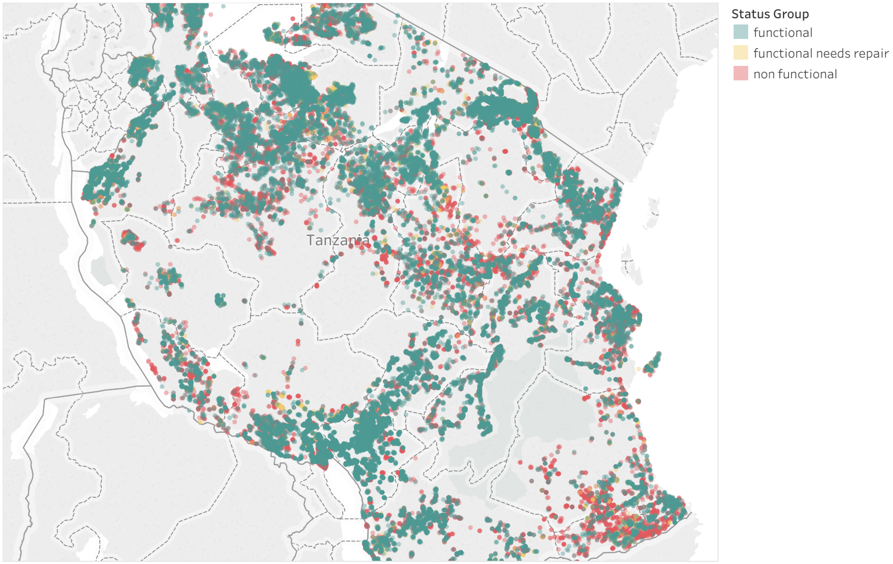
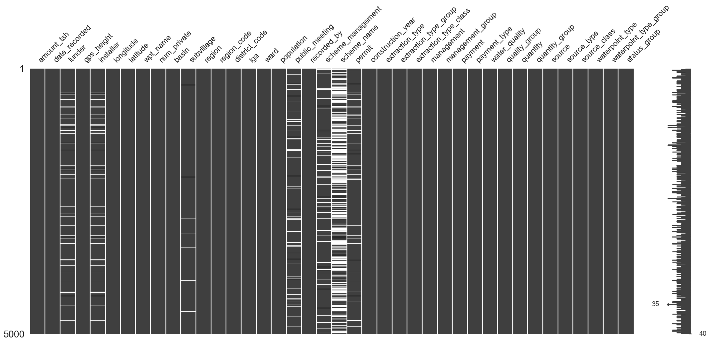

# Is There Water?
### Tanzania

A social impact driven tech firm hosts open competitions to crowdsource data science solutions to social challenges, with potential utility by organizations and institutions taking on those challenges. The online challenges last a few months, the global community of data scientists can compete to provide the best statistical model for difficult predictive social impact problems. One of the competitions asks participants to predict whether or not any given water point - from a dataset with a variety of descriptive feature data on tens of thousands of water points - is functioning, in need of repair, or broken.

Tanzania has achieved has averaged 6.5% economic growth over the past decade and is on its way to becoming a middle income country. But inequalities are entrenched, and the country has seen only a modest reduction in poverty over the same period. Some 40% of the country's population are able to rely on regular access to safe drinking water sources.

In rural and underprivileged areas, improved water points are funded and installed by a wide array of actors - including the local government, civil society, international donors, private companies, and individuals - using a variety of technologies and water sourcing methods. Understanding when or how a water point might break or need maintenance could inform budget allocations and maintenance scheduling, ultimately optimizing access to safe water with those resources.

## The analysis questions
* What are the key predictors of whether or not a water point is functioning on any given day?
* Is there a machine learning model that can identify with reasonable certainty which water points are likely to need maintenance or replacement?

[**Interactive map**](https://sites.google.com/view/is-there-water/home)

## The dataset
* The raw CSV dataset, provided by the online competition, has 59,400 rows (each representing a water point in Tanzania) and 40 columns of descriptive features, which include information on various levels of geographical location, population using the water point, water point management and payment schemes, type and age of the hardware, water pressure at the tap, and type of water source.
* The target (to be predicted) is a categorical column with three classes: 'functional,' 'functional needs repair,' and 'non functional.'
* The following represents the first 5,000 rows of the dataset, with the white lines indicating missing data:

## **Exploratory data analysis (EDA), feature engineering, and feature selection**

* 'population' was converted to categorical data. 48% are 0s and 1s (probably inaccurate) and assigned value of 'unknown'. The rest of the data was divided into 1st, 2nd, and 3rd quartiles
* 70% of 'amount_tsh' are zeros - could be error or could mean water has to be pumped manually. 470 entries are between 5,000 - 350,000. Sort of uninterrpretable values
* 'amount_tsh' converted to categorical ranges
* 'permit' has 3,056 NaNs, which are converted to False, meaning no permit
* 'public_meeting' has 3,334 NaNs, which are converted to False, meaning no permit
* 'waterpoint_age' is a calculated feature with a handful of negatives and some with an age the same as the year recorded. Imputed with 0 and median, respectively
* 'funder' has 3635 NaNs and 777 “0”s. Many names have very low frequency (like 1)
* 'num_private' has 58,643 0s, and no explanation in the DrivenData description of what it means. Column dropped.
* 'population' has 21,381 0s.
* 20,709 records have an entry of '0' for 'construction_year'
* Spread of construction_year (of non-zeros): max=2013, min=1960, mean=1997
* 20,034 records have 0s for BOTH 'construction_year' AND 'population'
* 'amount_tsh' is the amount of static pressure in the pipe
* 41,639 records have 0 as the 'amount_tsh' value
* 'installer' has 2,145 unique values (installation entity names), including likely mispellings and low frequency values (occurring once or just a few times).
* df_mask = df[df['construction_year'] == df['population']]
* df_mask['construction_year'].value_counts()
* df_hist = df[df['amount_tsh'] > 5]
* df_hist = df_hist[df_hist['amount_tsh'] < 1000]
* df_hist['amount_tsh'].hist()

### Dataset deep dive details:
* [**Pandas dataframe profile: raw dataset**](http://htmlpreview.github.io/?https://github.com/mstyslinger/is_there_water_tz/blob/master/pandas_profile_reports/pfr_cleaned.html)

* [**Pandas dataframe profile: dataset featurized for analysis**](http://htmlpreview.github.io/?https://github.com/mstyslinger/is_there_water_tz/blob/master/pandas_profile_reports/pfr_cleaned.html) 

## Model fitting
Data were analyzed using:
* Random Forest Classifier
* Logistic Regression
* Naive Bayes?

### Random forest results:
* Precision
* Confusion matrix
* Feature importances

### Logistic regression results:
* Precision
* Adjusted R^2
* Coefficients

## Future work
* H2O Distributed Random Forest
* Flask app
