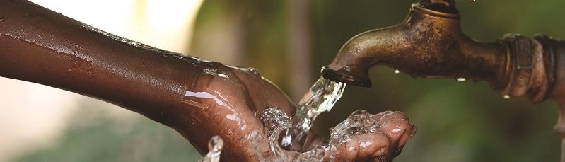

# Is There Water?
### Tanzania

* DrivenData competition
* Tanzania has achieved has averaged 6.5% economic growth over the past decade and is on its way to becoming a middle income country. But inequalities are entrenched, and the country has seen only a modest reduction in poverty over the same period. Some 40% of the country's population are able to rely on regular access to safe drinking water sources.
* In rural and underprivileged areas, improved water points are funded and installed by a wide array of actors - including the local government, civil society, international donors, private companies, and individuals - using a variety of technologies and water sourcing methods. Understanding when or how a water point might break or need maintenance could inform budget allocations and maintenance scheduling, ultimately optimizing access to safe water with those resources.

### The analysis questions:
* What are the key predictors of whether or not a water point is functioning on any given day?
* Is there a machine learning model that can identify with reasonable certainty which water points are likely to need maintenance or replacement?

### The dataset:

* CSV
* Include PandasProfiling output

## **Exploratory data analysis (EDA) & Feature Engineering**

[**Pandas dataframe profile**](http://htmlpreview.github.io/?https://github.com/mstyslinger/is_there_water_tz/blob/master/pandas_profile_reports/pfr_cleaned.html) 

